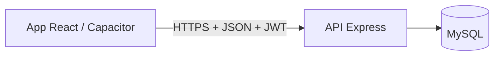
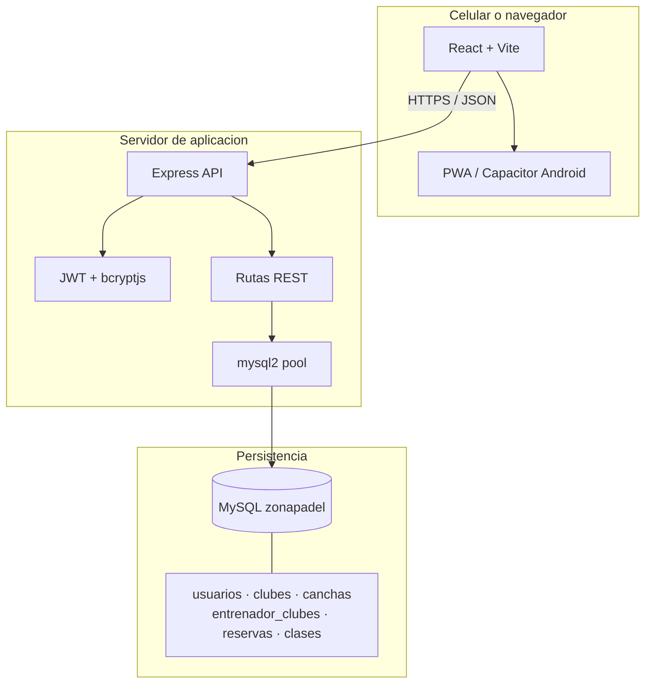
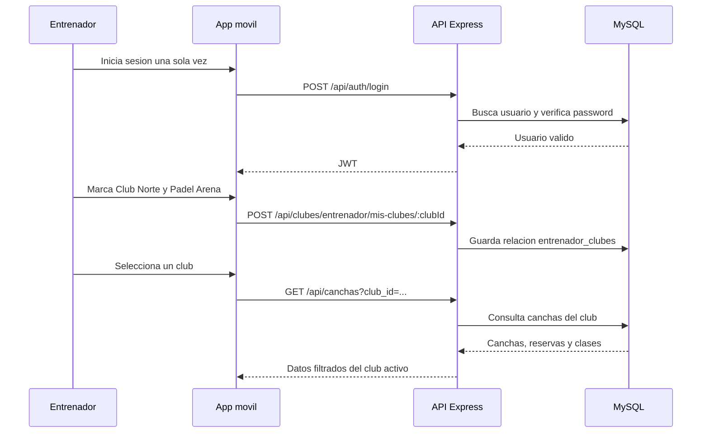
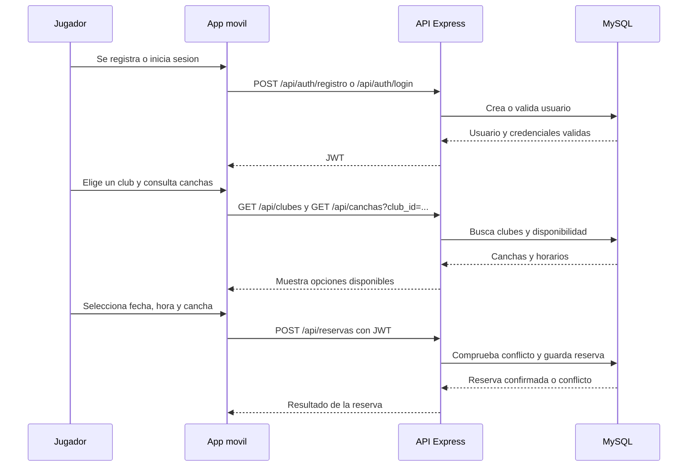
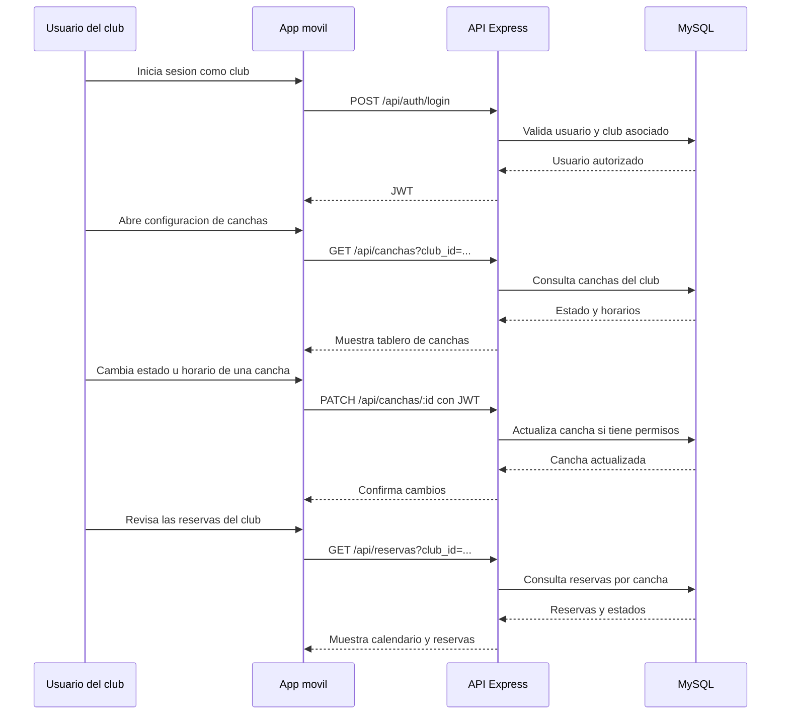
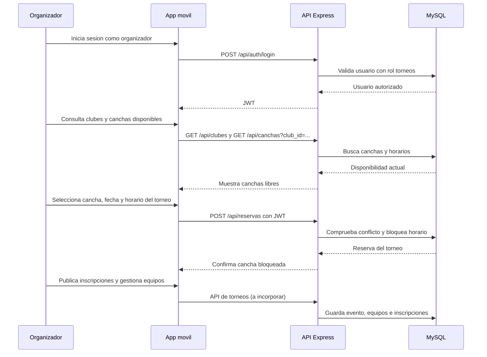

# ZonaPadel

ZonaPadel es una aplicacion para descubrir clubes, consultar canchas, administrar reservas y gestionar clases de padel. La interfaz funciona como web y como aplicacion movil mediante Capacitor.

## Arquitectura



### Componentes



### Flujo del entrenador con varios clubes



### Flujo del jugador



El jugador puede consultar sus reservas, cancelar una reserva según las reglas del negocio y descubrir clases o partidos disponibles. La comprobación de disponibilidad ocurre en la API para evitar reservas duplicadas desde distintos celulares.

### Flujo del club



El rol `club` administra las canchas y visualiza las reservas de su entidad. Los cambios quedan guardados en MySQL y luego pueden ser consultados por jugadores y entrenadores mediante la API.

### Flujo de la persona organizadora de torneos



El rol `torneos` puede consultar disponibilidad y bloquear canchas para un evento. Para completar la gestión de torneos, el modelo de datos deberá incorporar tablas como `torneos`, `equipos` e `inscripciones`; esas tablas todavía no forman parte del esquema inicial.

- **Celular:** contiene la interfaz React compilada. No necesita instalar MySQL.
- **API:** servidor Node.js + Express. Valida usuarios, permisos, clubes y conflictos de reservas.
- **Base de datos:** MySQL centralizado. Guarda usuarios, clubes, canchas, reservas y clases de forma persistente.
- **Autenticacion:** JWT. La app envia el token en `Authorization: Bearer <token>`.

La app movil nunca debe conectarse directamente a MySQL. Las credenciales de la base de datos permanecen en el servidor y el celular consume la API.

## Stack

- Frontend: React 18 + Vite
- Backend: Node.js + Express
- Base de datos: MySQL 9 (compatible con MySQL 8)
- Acceso a datos: `mysql2`
- Autenticacion: `jsonwebtoken` + `bcryptjs`
- Aplicacion movil: Capacitor Android y PWA
- Monorepo: npm workspaces

## Requisitos

- Node.js 20 LTS recomendado
- npm 10 o superior
- MySQL 8 o superior
- PowerShell en Windows, Terminal en macOS/Linux

Node 21 puede generar problemas con dependencias nativas opcionales de Vite/Rolldown. Para este proyecto se recomienda Node 20 LTS.

## Estructura principal

```text
apps/
	server/
		server.js                 # Servidor Express y montaje de rutas
		src/
			auth.js                 # JWT y middleware de permisos
			db.js                   # Pool de conexiones MySQL
			routes/
				auth.routes.js
				clubes.routes.js
				canchas.routes.js
				reservas.routes.js
				clases.routes.js
		sql/schema.sql            # Tablas y datos iniciales
	web/
		src/App.jsx               # Interfaz React
		src/index.css             # Sistema visual
```

## Instalacion

Desde la carpeta raiz del proyecto:

```powershell
cd C:\Users\carla\OneDrive\Documentos\zonapadel
npm install
```

## Configurar MySQL local

El servicio MySQL debe estar iniciado. En Windows puede verificarse con:

```powershell
Get-Service -Name "*mysql*"
```

Crear la base, las tablas y los clubes/canchas iniciales:

```powershell
mysql -u root -p < apps/server/sql/schema.sql
```

En PowerShell, si `mysql` no esta en el PATH, usar la ruta completa de la instalacion:

```powershell
& "C:\Program Files\MySQL\MySQL Server 9.0\bin\mysql.exe" -u root -p
```

Dentro del cliente MySQL:

```sql
source C:/ruta/al/proyecto/apps/server/sql/schema.sql;
```

El script crea la base `zonapadel`, sus tablas y tres clubes de prueba. Se puede ejecutar mas de una vez; los clubes existentes no se duplican.

## Variables de entorno

Copiar `apps/server/.env.example` como `apps/server/.env` y completar la contrasena de MySQL:

```powershell
Copy-Item apps/server/.env.example apps/server/.env
```

Contenido esperado:

```env
PORT=3003
DB_HOST=localhost
DB_PORT=3306
DB_USER=root
DB_PASSWORD=tu_contrasena_de_mysql
DB_NAME=zonapadel
JWT_SECRET=un_secreto_largo_y_aleatorio
```

El archivo `.env` esta ignorado por Git. Nunca subir contrasenas ni secretos reales al repositorio.

## Levantar el proyecto

Desde la raiz:

```powershell
npm run dev
```

Direcciones locales:

- Frontend: `http://localhost:5173`
- API: `http://localhost:3003/api`
- Health check: `http://localhost:3003/api/health`

Para ejecutar solo el backend:

```powershell
npm run start
```

Si Vite informa `EPERM` al borrar `apps/web/node_modules/.vite`, cerrar procesos anteriores de Vite/Node y limpiar la carpeta:

```powershell
Remove-Item apps/web/node_modules/.vite -Recurse -Force
npm run dev
```

OneDrive puede bloquear archivos durante la sincronizacion. Para desarrollo frecuente conviene mantener el proyecto en una carpeta local que no sincronice OneDrive, por ejemplo `C:\dev\zonapadel`.

## API REST

### Publicos

```text
GET  /api/health
GET  /api/clubes
GET  /api/clubes/:id
GET  /api/canchas
GET  /api/canchas?club_id=club-padel-norte
```

### Autenticacion

```text
POST /api/auth/registro
POST /api/auth/login
```

Ejemplo de registro:

```json
{
	"nombre": "Martina Ruiz",
	"email": "martina@example.com",
	"password": "una-contrasena-segura",
	"rol": "entrenador"
}
```

Los roles disponibles son `jugador`, `club`, `entrenador` y `torneos`.

### Entrenadores y multiples clubes

Un entrenador inicia sesion una sola vez y se relaciona con varios clubes mediante la tabla puente `entrenador_clubes`:

```text
GET    /api/clubes/entrenador/mis-clubes
POST   /api/clubes/entrenador/mis-clubes/:clubId
DELETE /api/clubes/entrenador/mis-clubes/:clubId
```

La app muestra un check por cada club seleccionado. Luego el entrenador puede cambiar de club desde el selector y consultar sus canchas, reservas y clases asociadas.

### Reservas y clases

```text
GET   /api/reservas?club_id=club-padel-norte
POST  /api/reservas
PATCH /api/reservas/:id/estado

GET  /api/clases?club_id=club-padel-norte
POST /api/clases
```

Todas las rutas privadas requieren:

```text
Authorization: Bearer <token>
```

El backend rechaza una reserva cuando la misma cancha ya tiene una reserva activa para la fecha y hora solicitadas.

## Modelo de datos

- `usuarios`: cuentas, roles y contrasenas hasheadas.
- `clubes`: clubes disponibles.
- `canchas`: canchas pertenecientes a un club y su estado.
- `entrenador_clubes`: relacion muchos a muchos entre entrenadores y clubes.
- `reservas`: reservas de jugadores o entrenadores, con estado y horario.
- `clases`: clases creadas por entrenadores en un club y, opcionalmente, una cancha.

## Construir la web

```powershell
npm run build
```

El resultado queda en `apps/web/dist`.

## Uso en celular

### PWA

Para probarla en el celular, el frontend debe estar publicado por HTTPS. En Android o iPhone:

1. Abrir la URL publicada en el navegador.
2. Elegir **Agregar a pantalla de inicio** o **Instalar aplicacion**.

La PWA sigue consumiendo la API publicada, no una base de datos local.

### APK Android con Capacitor

Capacitor empaqueta la interfaz web como una app Android. MySQL sigue ejecutandose en el servidor y la app usa la URL publica de la API.

Para una version movil real hay que configurar la URL de produccion de la API, generar el build web y sincronizar Capacitor. Para publicar en iPhone se requiere macOS + Xcode.

## Produccion

En produccion se necesitan dos servicios:

1. **Frontend:** Vercel u otro hosting estatico.
2. **API + MySQL:** un servidor Node.js y una base MySQL accesibles desde internet, por ejemplo Railway, Render, un VPS o un proveedor administrado.

Configurar en produccion:

- `DB_HOST`, `DB_PORT`, `DB_USER`, `DB_PASSWORD` y `DB_NAME` del proveedor MySQL.
- `JWT_SECRET` aleatorio y privado.
- URL HTTPS de la API en el frontend.
- CORS limitado al dominio real del frontend.
- Backups automaticos de MySQL.

No se debe exponer MySQL directamente a la app movil ni commitear archivos `.env`.

## Scripts

```powershell
npm run dev        # frontend y backend en desarrollo
npm run build      # build de produccion del frontend
npm run start      # solo backend
```

## Seguridad y mantenimiento

Antes de publicar:

```powershell
npm audit
```

Revisar cada vulnerabilidad antes de usar `npm audit fix --force`, porque puede actualizar Vite, Capacitor u otras dependencias principales y romper compatibilidad.
